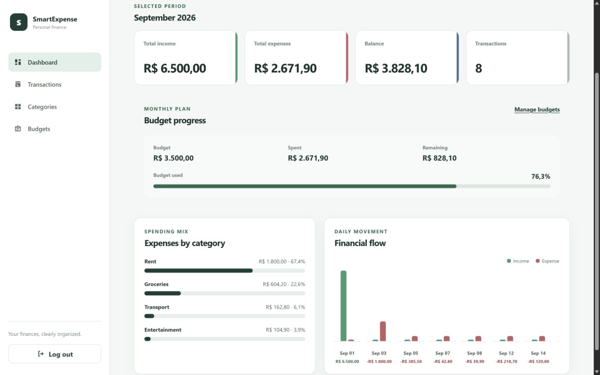
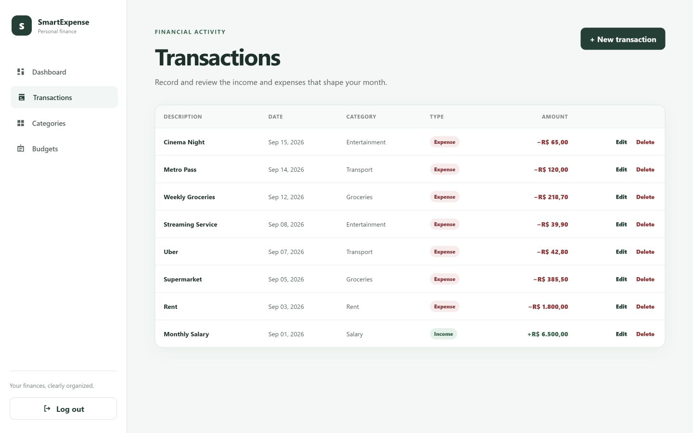
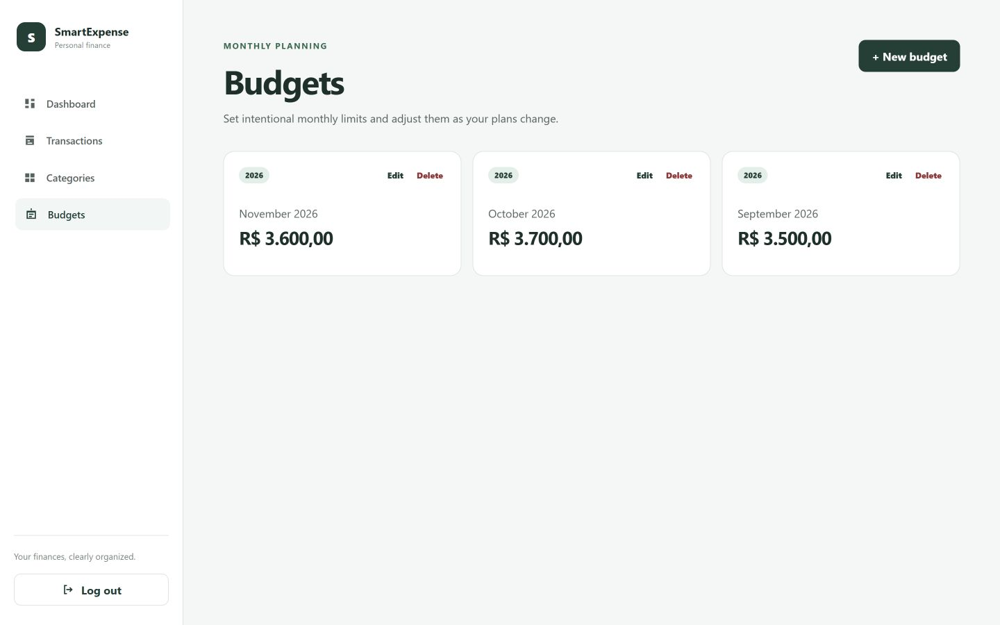
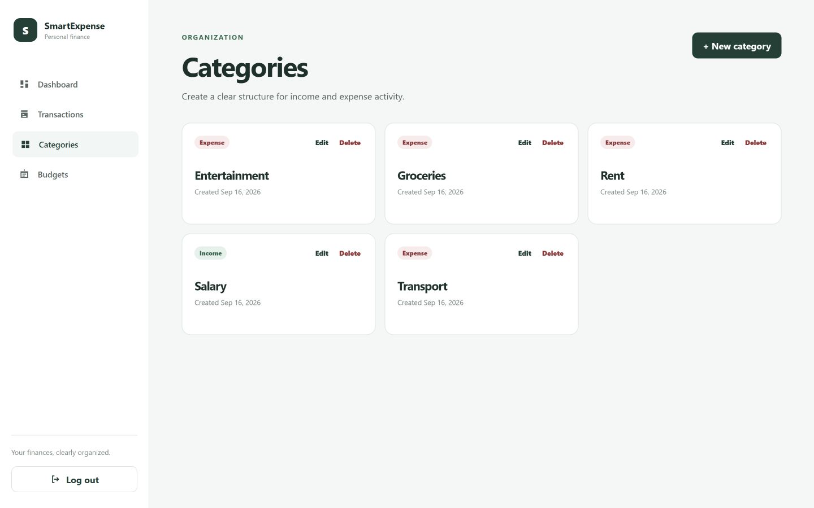
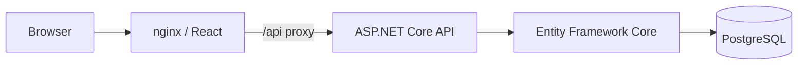
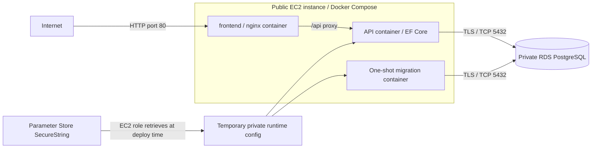
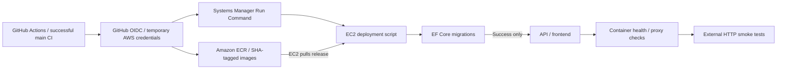

# SmartExpense

A full-stack personal finance application featuring automated CI/CD, containerized deployment, and AWS infrastructure as code.

[](https://github.com/BoarettoFelipe/smart-expense/actions/workflows/ci.yml)


## Overview

SmartExpense brings income, expenses, categories, monthly budgets, and financial insights into one authenticated workspace. Users can maintain their records and compare monthly spending against a budget without sharing financial data with other accounts.

This portfolio project covers the complete delivery path: a React interface, a layered .NET backend, PostgreSQL persistence, automated tests, Docker images, Terraform infrastructure, and GitHub Actions delivery to AWS. Its cloud environment is a temporary demonstration, not a highly available production architecture.

## Screenshots

Real screenshots of the AWS-hosted application using a disposable account and fictional financial data. Currency is displayed in Brazilian reais (BRL).

### Dashboard

Monthly totals, balance, budget usage, spending distribution, and daily flow.



### Transactions

Income and expense records with matching categories and dated activity.



### Budgets

One overall spending target per user and calendar month, rather than per-category budgets.



### Categories

Income and expense categories organize transaction entry.



## Key Features

- **Authentication:** registration and login through ASP.NET Core Identity and JWT bearer tokens.
- **User-scoped data:** authenticated identity determines ownership; financial queries are scoped to that user.
- **Transactions:** create, list, retrieve, edit, and delete income and expense records.
- **Categories:** manage income/expense categories; categories referenced by transactions cannot be deleted.
- **Monthly budgets:** manage spending targets, with database-enforced uniqueness per user/month/year.
- **Dashboard:** select a month/year to see totals, balance, transaction count, budget progress, expenses by category, and daily financial flow.
- **Category/type consistency:** transaction creation and updates require matching category types. The UI filters options and clears incompatible selections on type changes.
- **Responsive UI:** desktop and smaller-screen layouts, protected navigation, dialogs, and loading/error/empty states.

## Architecture

### Application request path



The backend separates responsibilities across four projects:

- **Domain:** entities, enums, validation, and controlled updates; no framework or persistence dependencies.
- **Application:** use cases, DTOs/results, current-user and persistence abstractions.
- **Infrastructure:** EF Core mappings/migrations, PostgreSQL repositories, Identity, JWT generation, and dashboard queries.
- **API:** thin controllers, HTTP contracts, authentication/authorization, and dependency injection composition.

Repositories and `IUnitOfWork` share one scoped `SmartExpenseDbContext`. Repositories do not commit changes independently. Transactions reference categories with restrictive deletion, preserving historical records.

### AWS runtime



Only nginx exposes a host port. The API remains on the Docker network, and AWS uses RDS instead of a PostgreSQL container.

### Delivery path



## Tech Stack

| Area | Technologies |
| --- | --- |
| Frontend | React 19, TypeScript, Vite, React Router, nginx |
| Backend | .NET 10, ASP.NET Core Web API, Entity Framework Core 10, ASP.NET Core Identity, JWT |
| Database | PostgreSQL 18, Npgsql |
| Testing | xUnit, Testcontainers PostgreSQL, Python unittest, mocked PowerShell deployment tests |
| Infrastructure | AWS EC2, RDS, ECR, Systems Manager, Parameter Store, IAM, GitHub OIDC, Terraform |
| DevOps | Docker, Docker Compose, GitHub Actions |

## Repository Structure

```text
backend/
  src/
    SmartExpense.Api/
    SmartExpense.Application/
    SmartExpense.Domain/
    SmartExpense.Infrastructure/
  tests/SmartExpense.Tests/
frontend/
infra/aws/
  deployment/
.github/workflows/
docs/images/
```

## Local Development

### Prerequisites

- .NET 10 SDK.
- Node.js 24 and npm.
- Docker Desktop with Linux containers and Docker Compose.

Deployment tooling/tests only: PowerShell 7 for the sender and its tests, and Python 3 for runtime configuration and helper tests. Neither is required for normal host application development.

Run the commands below from the repository root unless stated otherwise.

### Host development

1. Copy `.env.example` to `.env` and replace its password/signing-key placeholders with unique local values. Keep this ignored file local.
2. Start PostgreSQL only:

   ```shell
   docker compose up -d
   ```

3. Configure API user secrets outside tracked configuration. Substitute your local values; the database password must match `.env`:

   ```shell
   dotnet user-secrets set "Jwt:SigningKey" "<LOCAL_SIGNING_KEY_AT_LEAST_32_BYTES>" --project backend/src/SmartExpense.Api
   dotnet user-secrets set "ConnectionStrings:DefaultConnection" "Host=localhost;Port=5432;Database=smart_expense;Username=smart_expense;Password=<LOCAL_POSTGRES_PASSWORD>" --project backend/src/SmartExpense.Api
   ```

4. Restore the EF tool and apply migrations:

   ```shell
   dotnet tool restore
   dotnet ef database update --project backend/src/SmartExpense.Infrastructure --startup-project backend/src/SmartExpense.Api
   ```

5. Start the API with its HTTP development profile:

   ```shell
   dotnet run --project backend/src/SmartExpense.Api --launch-profile http
   ```

6. In a second terminal:

   ```shell
   cd frontend
   npm ci
   npm run dev
   ```

Open the URL printed by Vite (normally `http://localhost:5173`). Its development proxy forwards `/api` to `http://localhost:5239`. Copy [frontend/.env.example](frontend/.env.example) to `frontend/.env.local` only if the proxy target needs to change.

Subsequent sessions normally need only PostgreSQL, the API, and Vite; apply migrations when the schema evolves.

### Full Docker stack

With a unique `POSTGRES_PASSWORD` and `JWT_SIGNING_KEY` in the root `.env`:

```shell
docker compose --profile app up --build
```

Open [http://localhost:8080](http://localhost:8080). Stop without deleting data:

```shell
docker compose --profile app down
```

`docker compose down -v` deletes PostgreSQL data and is not a normal shutdown. Use it only for an intentional disposable-database reset.

## Docker

Root Compose starts **PostgreSQL only** by default. The `app` profile adds a one-shot EF migration container after database health succeeds, the API after successful migrations, and nginx/React after API health succeeds. API and frontend each have health checks.

nginx proxies `/api` internally, keeping browser requests same-origin. Multi-stage Dockerfiles provide API, migration, and frontend runtime targets. AWS uses a separate [deployment Compose file](infra/aws/deployment/compose.yaml), with no local database.

Root environment variables are server-side configuration. `VITE_` variables are browser-visible and must never contain secrets.

## Testing

Backend tests cover Domain rules, application behavior, ownership isolation, authentication/HTTP authorization, dashboard calculations, and persistence. Integration tests apply migrations to isolated real PostgreSQL instances through Testcontainers; they do not mutate the development database. Docker must be available for the full backend suite.

```shell
dotnet build backend/SmartExpense.slnx --configuration Release
dotnet test backend/SmartExpense.slnx --configuration Release --no-build
```

From `frontend`:

```shell
npm run lint
npm run build
```

Deployment helper tests run without contacting AWS:

```shell
pwsh -File infra/aws/deployment/test_sender.ps1
python -B -m unittest discover -s infra/aws/deployment -p "test_*.py" -v
```

Python Compose tests require the Docker CLI. CI also builds and starts an isolated full Docker stack, checks migrations, health, frontend HTTP 200, and an unauthenticated API request through nginx returning HTTP 401, then removes the test stack and its volume.

The [deployment guide](infra/aws/deployment/README.md) describes a separate local AWS-compose smoke test, using locally built validation images, fake credentials, and disposable PostgreSQL.

## CI/CD

[ci.yml](.github/workflows/ci.yml) handles validation and delivery.

**Pull requests targeting main:** backend restore/build/tests, frontend lint/build, deployment helper tests, and Docker smoke. Deployment is skipped.

**Pushes/merges to main:** the same checks must succeed before `deploy` runs:

1. Assume the deploy IAM role through GitHub OIDC, scoped to the expected account.
2. Authenticate Docker to ECR with temporary credentials.
3. Build the three existing Docker targets for `linux/amd64`.
4. Push API/frontend tags using `GITHUB_SHA`, plus `GITHUB_SHA-migrations`.
5. Send the non-secret SSM payload and wait for completion.
6. Require successful migrations, container health, and the internal nginx proxy check.
7. Require external `GET /` = HTTP 200 and unauthenticated `GET /api/transactions` = HTTP 401, with bounded retries.

No permanent AWS access keys are stored in GitHub. The runner does not read SecureStrings. Infrastructure-dependent values use Repository Variables: `AWS_ACCOUNT_ID`, `AWS_DEPLOY_ROLE_ARN`, `EC2_INSTANCE_ID`, `EC2_PUBLIC_IP`, and `RDS_HOST`. See the [deployment guide](infra/aws/deployment/README.md) for setup.

The deploy job has only `contents: read` and `id-token: write`. OIDC trust is restricted to the repository's main-branch identity; no GitHub Environment is used. Deployment concurrency prevents simultaneous CD jobs without cancelling an active deployment. GitHub pending-run concurrency is not FIFO; check the final running SHA after rapid merges. A host lock also protects against concurrent manual deployments.

## AWS Infrastructure

Terraform describes a low-complexity, temporary demonstration environment:

- A dedicated VPC with two subnets in separate Availability Zones and an Internet Gateway.
- One public EC2 instance running Docker Compose on port 80, and non-public, single-AZ RDS PostgreSQL with encrypted gp3 storage.
- Two private ECR repositories, IAM runtime/deployment roles, SSM administration, and Parameter Store SecureStrings.
- Security groups restricting PostgreSQL port 5432 to the EC2 security group, with no SSH keys or port 22.
- AWS Budget email alerts when a subscriber email is supplied.

Both subnets use the public route table. RDS is nevertheless **not publicly accessible** and protected by its security group; this is not a dedicated private-subnet topology. There is no ALB, NAT Gateway, ECS/Fargate, Kubernetes, Elastic IP allocation, or Route 53 hosted zone.

The environment incurs potential compute, storage, public IPv4, and data-transfer costs; Budget alerts do not cap spending. See the [infrastructure guide](infra/aws/README.md) for configuration, costs, and owner-controlled teardown.

## Security

- Authenticated identity scopes financial data; Identity manages passwords, and JWT validation checks issuer, audience, lifetime, and signing key.
- Administration uses SSM rather than SSH. The API has no direct public port, and non-public RDS accepts only EC2-to-RDS traffic with TLS certificate verification.
- EC2 requires IMDSv2 and uses its instance role. GitHub uses OIDC temporary credentials, not long-lived access keys.
- Parameter Store secrets are retrieved on EC2, never sent to the frontend or built into images.

**Demo caveats:** HTTP browser traffic requires disposable accounts and fictional data. localStorage sessions are vulnerable to XSS, and root/Docker administrators can inspect container secrets.

Main-branch code can run root-level SSM commands; code review and branch protection are security boundaries. See the [infrastructure](infra/aws/README.md) and [deployment](infra/aws/deployment/README.md) guides for IAM and secret-handling details.

## Deployment

Release tags identify the triggering commit rather than `latest`:

```text
smart-expense-api:<commit-sha>
smart-expense-api:<commit-sha>-migrations
smart-expense-frontend:<commit-sha>
```

SHA-tag immutability is an operational convention: ECR allows overwrites, and rebuilds can resolve different mutable base images.

Migrations must succeed before API/frontend are updated. Delivery then requires container health, proxy checks, successful SSM completion, and external smoke tests, as described in CI/CD above.

Manual deployment remains available through `deploy-via-ssm.ps1`. The [manual/CD guide](infra/aws/deployment/README.md) covers credentials, payload preparation, execution/wait options, cleanup, monitoring, and failure diagnosis.

## Terraform

Infrastructure code lives in [infra/aws/](infra/aws/); application CI/CD does not run Terraform or provision resources.

The local backend uses an externally configured state path, with no hardcoded workstation path. State, plans, secrets, and backups stay outside the repository and cloud-synced folders; `sensitive` does not remove secrets from state/plans. See the [Terraform guide](infra/aws/README.md) for initialization, variables, and teardown precautions.

## Limitations

- Temporary demo, not a production baseline: one EC2 instance, single-AZ RDS, and HTTP without a custom domain.
- In-place deployment can cause downtime; no automatic database rollback. Migrations must support any still-running old API.
- Demo RDS backups/final snapshots are disabled.
- The demo uses intentionally small compute/storage resources and short ECR retention to keep the environment lightweight.
- Liveness/proxy checks do not establish full authenticated business readiness.
- Category type changes do not retroactively repair existing transactions; compatibility is checked on transaction create/update.

## Future Improvements

The following are **not implemented**:

- CSV bank-statement import and duplicate detection.
- Automated categorization and Open Finance integration.
- HTTPS and a custom domain.
- Centralized application observability and health alerting.
- Zero-downtime deployment and stronger release/rollback controls.

## License

Licensed under the [MIT License](LICENSE).
